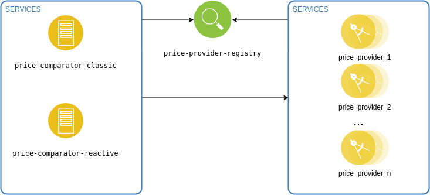

# price-comparator
Demo application presents performance difference between classic and reactive spring web approaches.

### Application infrastructure

The following modules create the whole environment:
 - price-provider-registry - service discovery server using netflix eureka implementation
 - price-provider - eureka client with single rest endpoint that returns given product price
 - price-comparator - uses all registered in eureka services to collect prices for a given product. Application is based on classic spring mvc.
 - price-comparator - uses all registered in eureka services to collect prices for a given product. Application is based on new spring reactive support.

### Run the application
To start the applicaton type the following command:

<code>docker-compose up --build</code>

### Scale the number of price providers
Using docker compose it is very easy to increase number of active price providers. For example
to create 4 instances of price-provider in runtime, type the following command:

<code>docker-compose scale price-provider=4</code>

### Endpoints

localhost:8081 - eureka monitoring panel
localhost:8082/api/prices/product/{productName} - GET rest endpoint which returns all available prices. Uses spring classic mvc. 
localhost:8083/api/prices/product/{productName} - GET rest endpoint which returns all available prices. Uses react spring approach.

Product name are defined in price-provider/src/main/resources/application.properties file.

### Classic mvc vs spring reactive stack

Given:

4 instance of price-provider are registered in eureka.

When:

Both price-comparator-classic and price-comparator-react are asked for available prices for given product.

The tests results are presented in the table:

|Test number|classiv mvc response time(ms)|reactive stack response time(ms)|
|-----------|-------------------------|----------------------------|
|1|6446|1876|
|2|6061|1521|
|3|6067|1520|

### Related materials
1. https://docs.spring.io/spring/docs/current/spring-framework-reference/web-reactive.html
2. https://github.com/odrotbohm/reactive-4te
3. https://www.youtube.com/watch?v=E3s5f-JF8z4